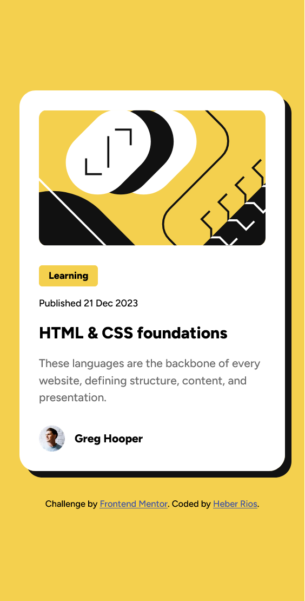
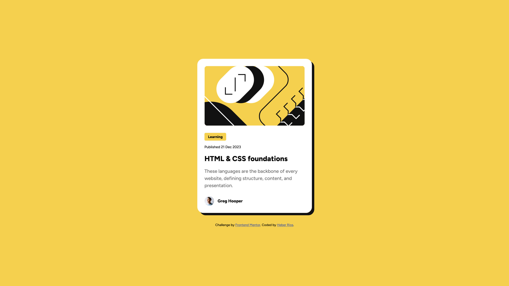

# Frontend Mentor - Blog preview card solution

This is a solution to the [Blog preview card challenge on Frontend Mentor](https://www.frontendmentor.io/challenges/blog-preview-card-ckPaj01IcS). Frontend Mentor challenges help you improve your coding skills by building realistic projects.

## Table of contents

-   [Overview](#overview)
    -   [The challenge](#the-challenge)
    -   [Screenshot](#screenshot)
    -   [Links](#links)
-   [My process](#my-process)
    -   [Built with](#built-with)
    -   [What I learned](#what-i-learned)
    -   [Continued development](#continued-development)
    -   [Useful resources](#useful-resources)
-   [Author](#author)
-   [Acknowledgments](#acknowledgments)

## Overview

### The challenge

Users should be able to:

-   See hover and focus states for all interactive elements on the page

### Screenshot

-   mobile design 
-   desktop design 

### Links

-   [Solution URL](https://www.frontendmentor.io/solutions/responsive-blog-preview-card-with-html-and-css-btm-IJQxGK)
-   [Github pages](https://heberrios.github.io/blog-preview-card/)

## My process

### Built with

-   Semantic HTML5 markup
-   CSS custom properties
-   Flexbox
-   Mobile-first workflow

### What I learned

First I learn about the use of header tag inside of an article element, this
with a semantic meaning.

The correct use of the alt attribute, describing the content of the image instead of
the image name.

The use of general CSS classes, to divide content, such as container or wrapper.

The use of the time tag for dates with format (datetime = YYYY-MM-DD).

Not set the font-size in the body, to let the user change it from the browser.

The use of the clamp CSS property, for responsive typography:

```
    font-size: clamp(1.25rem, 2dvw, 1.5rem);
```

clamp(min,pref,max)

-   The min value to restrict the font shrinking less than this value.
-   The pref value to resize the font depending on the dynamic view width.
-   the max value to restrict the font growing more than this value.

### Continued development

Have a better understanding of semantic HTML and fluid typography.

### Useful resources

-   [Why use rem instead of px](https://www.youtube.com/watch?v=xCSw6bPXZks) - This taught me
    a new best practice for responsive design.

-   [Use of clamp](https://www.youtube.com/watch?v=erqRw3E-vn4&t=202s) - This is an amazing article which helped me understand CSS clamp better. I'd recommend it to anyone still learning this concept.

## Author

-   Frontend Mentor - [@HeberRios](https://www.frontendmentor.io/profile/HeberRios)

## Acknowledgments

-   Frontend Mentor - [@JEWebDev](https://www.frontendmentor.io/profile/JEWebDev)
